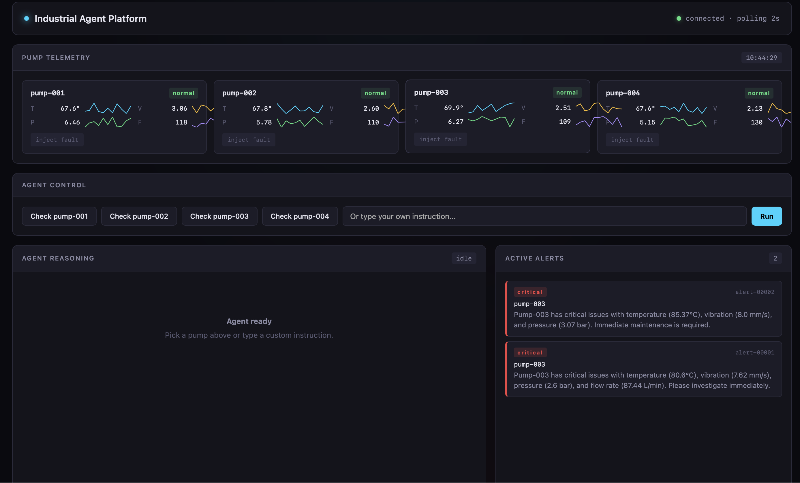
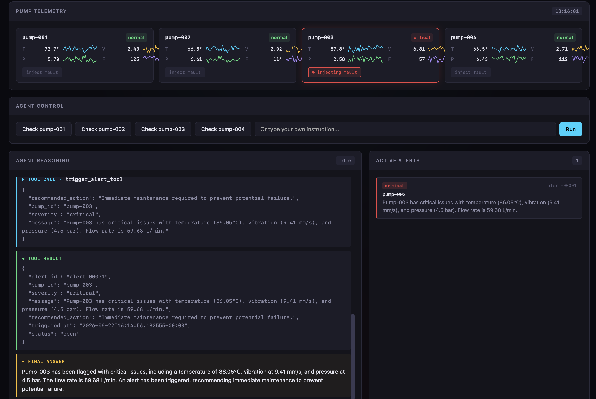
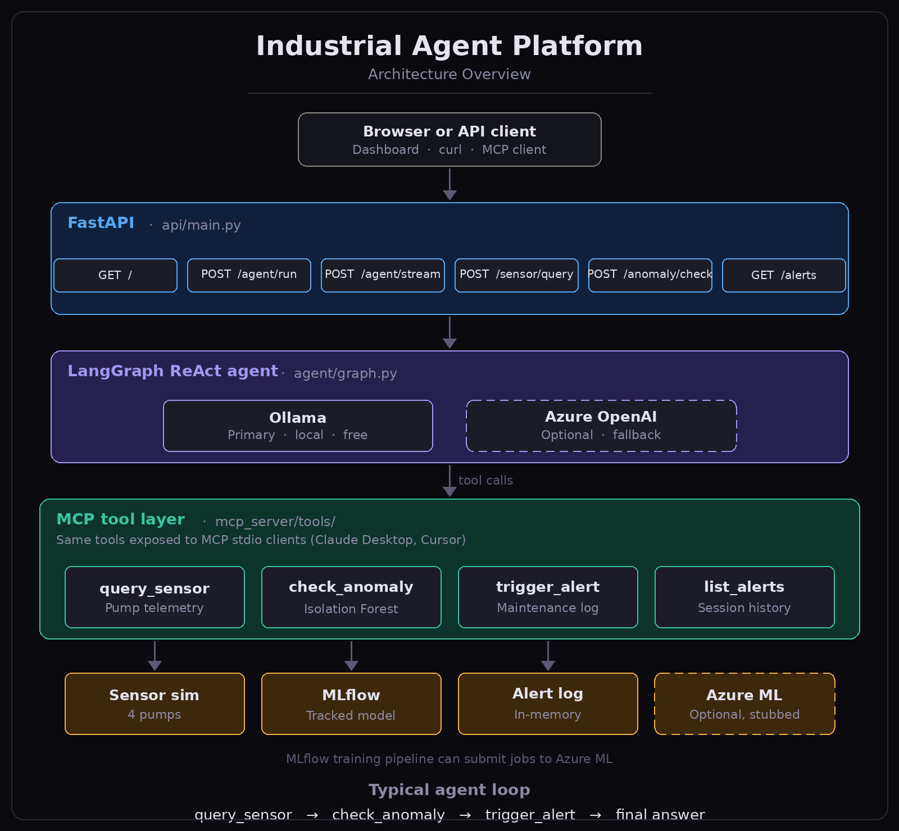

# Industrial Agent Platform

An AI agent system that monitors simulated industrial pump telemetry, detects anomalies with a tracked ML model, and triggers automated maintenance alerts. Tools are exposed both through a **Model Context Protocol (MCP)** server and through a **LangGraph** ReAct agent reachable via FastAPI, with a live streaming dashboard.

---

## Dashboard


*All four pumps reporting normal telemetry with live sparklines. The agent has raised two critical alerts for pump-003 after fault injection.*


*Agent Reasoning panel streaming tool calls in real time. Active Alerts panel showing one critical alert triggered by the agent after it ran the anomaly model.*

---

## Architecture



---

## Stack

| Layer              | Technology                                         |
|--------------------|----------------------------------------------------|
| Primary LLM        | Ollama `qwen2.5:7b` (local, free, no API key)      |
| Fallback LLM       | Azure OpenAI (auto-activated when Ollama is down)  |
| Agent framework    | LangGraph + LangChain                              |
| Tool protocol      | Anthropic MCP Python SDK                           |
| API                | FastAPI + Uvicorn                                  |
| Observability      | Prometheus via `prometheus-fastapi-instrumentator`  |
| Dashboard          | Vanilla HTML/JS, SSE streaming (no build step)     |
| Anomaly model      | scikit-learn Pipeline (StandardScaler → IsolationForest) |
| Experiment tracker | MLflow                                             |
| Cloud training     | Azure ML SDK v2 (stubbed locally)                  |
| Container          | Docker + Docker Compose                            |
| CI/CD              | GitHub Actions (ruff lint + pytest + Docker build)  |

---

## Quickstart

### Prerequisites

- Python 3.11+
- [Ollama](https://ollama.com) installed and running

```bash
# Install and start Ollama
brew install ollama          # macOS
brew services start ollama

# Pull the model used by the agent
ollama pull qwen2.5:7b
```

### Run locally

```bash
git clone <your-repo-url> industrial-agent-platform
cd industrial-agent-platform

# 1. Create and activate a Python environment
conda create -n water-ai python=3.11 -y
conda activate water-ai
pip install -r requirements.txt

# 2. Configure environment (no API keys required for local Ollama mode)
cp .env.example .env

# 3. Train the anomaly detection model
python -m mlops.train

# 4. Start the API
uvicorn api.main:app --reload

# 5. Open the dashboard
open http://localhost:8000
```

### Verify with curl

```bash
# Health check
curl http://localhost:8000/health
# → {"status":"ok"}

# Read a sensor (normal)
curl -s -X POST http://localhost:8000/sensor/query \
  -H "Content-Type: application/json" \
  -d '{"pump_id": "pump-001"}' | python3 -m json.tool

# Read a sensor (forced anomaly)
curl -s -X POST http://localhost:8000/sensor/query \
  -H "Content-Type: application/json" \
  -d '{"pump_id": "pump-003", "inject_anomaly": true}' | python3 -m json.tool

# Score readings directly against the anomaly model
curl -s -X POST http://localhost:8000/anomaly/check \
  -H "Content-Type: application/json" \
  -d '{"temperature_c": 92, "vibration_mm_s": 9, "pressure_bar": 2.5, "flow_rate_lpm": 55}' | python3 -m json.tool

# Run the full AI agent (queries → scores → alerts)
curl -s -X POST http://localhost:8000/agent/run \
  -H "Content-Type: application/json" \
  -d '{"message": "Check pump-003 right now and alert if anything is wrong. Use inject_anomaly=true."}' | python3 -m json.tool

# List all raised alerts
curl http://localhost:8000/alerts | python3 -m json.tool
```

### Run with Docker Compose

```bash
docker compose up --build
```

MLflow UI → http://localhost:5000  
API docs  → http://localhost:8000/docs

---

## LLM configuration

The agent tries **Ollama first** on every startup. If Ollama is unreachable (server not running, model not pulled), it automatically falls back to **Azure OpenAI**. No code change required — only env vars.

```ini
# .env

# --- Primary: Ollama (local, free) ---
OLLAMA_MODEL=qwen2.5:7b
OLLAMA_BASE_URL=http://localhost:11434

# --- Fallback: Azure OpenAI ---
# Leave blank to disable. Errors will surface if both providers fail.
AZURE_OPENAI_API_KEY=
AZURE_OPENAI_ENDPOINT=https://<resource>.openai.azure.com/
AZURE_OPENAI_DEPLOYMENT=<deployment-name>
AZURE_OPENAI_API_VERSION=2024-02-01
```

To switch the local model (any Ollama model with tool-call support works):

```bash
ollama pull llama3.1        # alternative
# then set OLLAMA_MODEL=llama3.1 in .env
```

> **Why `qwen2.5:7b`?** Benchmarks consistently show it outperforms `llama3.1:8b` on multi-step tool calling. The `llama3.1:8b` model tends to describe tool calls as text rather than executing them, breaking the ReAct loop.

---

## Live dashboard

Open `http://localhost:8000` after starting the API. The dashboard is a self-contained HTML file (no build step, no npm) that gives you:

| Panel | What it shows |
|---|---|
| **Pump Telemetry** | Live sparklines for temperature, vibration, pressure, flow — polled every 2 s |
| **Agent Control** | One-click check buttons per pump, plus a free-text instruction box |
| **Agent Reasoning** | Tool calls and results streaming in real time via SSE from `/agent/stream` |
| **Active Alerts** | All alerts the agent has raised this session, refreshed every 5 s |

### Testing the anomaly path end-to-end

1. Click **"inject fault"** on any pump card — the card border turns red
2. Click the corresponding **"Check pump-00X"** button
3. The agent will call `query_sensor_tool` with `inject_anomaly=true`, pass the readings to `check_anomaly_tool`, and if severity is `warning` or `critical`, call `trigger_alert_tool`
4. The alert appears in **Active Alerts** within seconds

> The "inject fault" toggle only affects the dashboard's own 2-second telemetry polling **and** the agent prompt when that pump's button is clicked. The agent always decides independently whether to raise an alert based on the anomaly model output — the toggle just ensures the readings it sees are anomalous.

---

## Run the MCP server standalone

```bash
python -m mcp_server.server
```

Wire into Claude Desktop by adding to `claude_desktop_config.json`:

```json
{
  "mcpServers": {
    "industrial-agent-platform": {
      "command": "python",
      "args": ["-m", "mcp_server.server"],
      "cwd": "/absolute/path/to/industrial-agent-platform"
    }
  }
}
```

The same four tools (`query_sensor`, `check_anomaly`, `trigger_alert`, `list_alerts`) are available to any MCP client without going through the FastAPI layer.

---

## API reference

| Method | Path             | Purpose                                              |
|--------|------------------|------------------------------------------------------|
| GET    | `/`              | Live dashboard (HTML)                                |
| GET    | `/health`        | Liveness probe                                       |
| GET    | `/metrics`       | Prometheus metrics (auto-instrumented)               |
| POST   | `/agent/run`     | Run agent, return `final_answer` + full `trace`      |
| POST   | `/agent/stream`  | Stream agent events as SSE (`tool_call`, `tool_result`, `final_answer`) |
| POST   | `/sensor/query`  | Direct sensor read (`pump_id`, `inject_anomaly`)     |
| POST   | `/anomaly/check` | Direct model scoring (four feature floats)           |
| GET    | `/alerts`        | List all alerts raised this session                  |

Every request is tagged with a unique `X-Correlation-ID` header (auto-generated if not provided), making it easy to trace agent runs end-to-end in logs.

`/agent/run` response shape:

```json
{
  "final_answer": "Pump-003 has critical issues...",
  "trace": [
    { "role": "user",      "content": "..." },
    { "role": "assistant", "content": "", "tool_calls": [{"name": "query_sensor_tool", "args": {...}}] },
    { "role": "tool",      "content": "{...sensor data...}" },
    { "role": "assistant", "content": "", "tool_calls": [{"name": "check_anomaly_tool", "args": {...}}] },
    { "role": "tool",      "content": "{is_anomaly: true, severity: critical, ...}" },
    { "role": "assistant", "content": "", "tool_calls": [{"name": "trigger_alert_tool", "args": {...}}] },
    { "role": "tool",      "content": "{alert_id: alert-00001, ...}" },
    { "role": "assistant", "content": "Final summary..." }
  ]
}
```

---

## Anomaly model

The anomaly detector is an **sklearn `Pipeline`** (`StandardScaler` → `IsolationForest`) trained **only on normal samples** (proper unsupervised setup). Wrapping the scaler and model in a single pipeline ensures that feature scaling is always applied consistently during both training and inference — no separate transform step to forget.

Synthetic data simulates four pump states across temperature, vibration, pressure, and flow. Anomaly profiles roughly match cavitation, bearing failure, and partial blockage.

| Metric    | Typical value |
|-----------|---------------|
| Accuracy  | ~96%          |
| Recall    | ~100%         |
| Precision | ~53%          |
| F1        | ~0.69         |

High recall is the priority: missing a real fault is worse than a false alarm. Every training run is logged to MLflow with params, metrics, and the serialized pipeline. The pipeline artifact is also saved to `artifacts/anomaly_pipeline.joblib` so inference has zero MLflow dependency at runtime.

---

## Azure ML training

Set the four env vars in `.env`:

```ini
AZURE_SUBSCRIPTION_ID=...
AZURE_RESOURCE_GROUP=...
AZURE_ML_WORKSPACE=...
AZURE_COMPUTE=cpu-cluster
```

Install the optional SDK and submit:

```bash
pip install azure-ai-ml azure-identity
az login
python -m mlops.azure_ml_pipeline
```

The same `train.py` runs on the Azure compute cluster. No changes to the agent or MCP layers.

---

## Tests

```bash
pytest -v
```

CI (`.github/workflows/ci.yml`) runs on every push to `main` and on pull requests:

1. **Lint** — `ruff check` and `ruff format --check` enforce style (CI fails on violations)
2. **Train** — builds the anomaly pipeline from scratch
3. **Test** — `pytest -v`
4. **Docker build** — builds the production image (depends on lint + test passing)

---

## Project layout

```
industrial-agent-platform/
├── api/
│   ├── main.py                # FastAPI routes + SSE streaming
│   └── static/
│       └── index.html         # Self-contained live dashboard
├── agent/
│   ├── graph.py               # LangGraph ReAct agent, Ollama→Azure fallback
│   └── prompts.py             # System prompt
├── mcp_server/
│   ├── server.py              # MCP server over stdio
│   └── tools/
│       ├── sensor_query.py    # Simulated pump telemetry
│       ├── anomaly_check.py   # Loads Isolation Forest artifacts
│       └── alert_trigger.py   # In-memory alert log
├── mlops/
│   ├── train.py               # Isolation Forest + MLflow tracking
│   ├── mlflow_tracking.py
│   └── azure_ml_pipeline.py   # Azure ML SDK v2 (stubbed locally)
├── docs/
│   └── screenshots/           # Dashboard screenshots
├── tests/
├── artifacts/                 # Model artifacts after training (git-ignored)
├── docker-compose.yml
├── Dockerfile
├── .env.example
├── .github/workflows/ci.yml
└── requirements.txt
```

---

## Production hardening

- Replace in-memory alert log with a persistent queue (Redis, Postgres, or a real CMMS connector)
- Move anomaly thresholds out of code into a config service, with per-pump calibration
- Add OpenTelemetry tracing on LangGraph tool nodes, export to Grafana/Tempo (Prometheus request metrics are already instrumented)
- Secrets from a vault, not `.env`
- Replace synthetic telemetry with a real OPC UA or MQTT client streaming into a time-series store (InfluxDB, TimescaleDB, OSIsoft PI)
- Train per-pump models (or one model with pump-id embedding) once real data is available
- Add alert deduplication and auto-resolution when readings return to normal

---

## License

MIT
